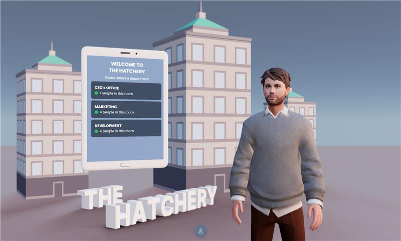
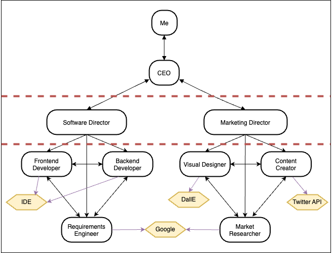

# The Hatchery: Democratizing Startup Creation with AI 🚀

Welcome to **The Hatchery**, a virtual startup incubator powered by collaborative AI agents. This project simplifies the process of turning ideas into reality, making entrepreneurship accessible for everyone, regardless of technical expertise, time, or resources.

---

## 🎥 Demo Video

Watch the demo video below to see The Hatchery in action!

[](http://www.youtube.com/watch?v=ytOrZurGb1k "The Hatchery - Video Demo")


---

## 🖥️ Architecture Overview

Here’s a high-level view of the system architecture that powers **The Hatchery**:

### Backend Architecture



Our backend leverages cutting-edge AI tools to simulate a collaborative workplace:
- **CrewAI**: Orchestrates interactions between AI agents.
- **Cohere**: Handles natural language generation for marketing content.
- **OpenAI**: Powers coding assistance and additional AI workflows.
- **LangChain**: Provides tooling for AI agents to use in reasoning.

### Frontend Architecture

The frontend, built with **React Three Fiber**, offers a visually engaging 3D simulation of an office environment, enabling users to interact with the system intuitively and see their virtual team in action.

---

## 🛠️ Features

- **Virtual CEO**: Accepts your startup idea and delegates tasks to specialized directors.
- **Collaborative AI Teams**:
  - **Software Director**: Oversees frontend and backend development, ensuring functional prototypes are delivered.
  - **Marketing Director**: Manages visual and content creation, producing high-quality promotional materials.
- **Real-Time Visualization**: Simulate team interactions in a dynamic 3D office environment.
<!-- - **Iterative Feedback**: Users can review outputs and refine results to match their vision. -->

---

## 🚀 Getting Started

### Prerequisites

- Node.js, npm, and yarn for the frontend.
- Python (3.8+) for the backend.
- API keys for OpenAI, Cohere, CrewAI, and LangChain.

### Installation

1. Clone the repository:
   ```bash
   git clone https://github.com/shaansuthar/hatchery.git
   cd the-hatchery
   ```

2. Install dependencies for the frontend and backend:

    ```bash
    cd client
    yarn install
    cd ../server
    yarn install
    ```

3. Set up environment variables:

- Create a .env file in the agents directory with API keys for:
    - OpenAI
    - Cohere
    - CrewAI
    - LangChain
- Use the .example-env file as a template:
```bash
cp .example-env .env
```

---

## 🏃 Usage
### Running the Frontend
The frontend requires two terminals:

1. **Terminal 1:** Start the server:

    ```bash
    cd server
    yarn run dev
    ```

2. **Terminal 2:** Start the client:

    ```bash
    cd client
    npm run dev
    ```

Access the frontend at http://localhost:5173/.

### Running the Backend Standalone (optional)

1. Navigate to the agents directory:

    ```bash
    cd agents
    ```
2. Add your idea to `idea.txt`.
   
3. Start the backend:

    ```bash
    crewai run
    ```

---

## 🤝 Contributing
We welcome contributions to improve The Hatchery. Please feel free to:

1. Fork the repository.
2. Create a new branch.
3. Submit a pull request.

